# Open Banking Rails

<p>
  
  
  
  
  
  
  
</p>

### Automatic personal finance tracking and analysis

Open Banking aggregator with PSD2-compliant multi-bank sync via Enable
Banking and a hybrid rules + LLM categorization engine. Transactions
arrive and sync on their own. Merchants and categories are inferred, not typed.

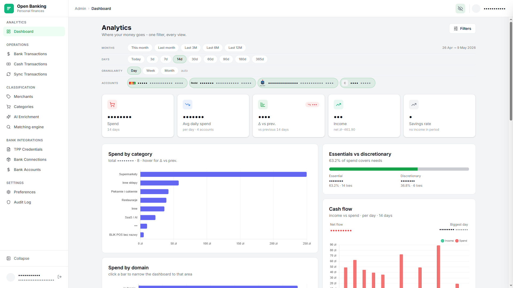

## What you get

| Feature                   | What it does                                                                                               |
|---------------------------|------------------------------------------------------------------------------------------------------------|
| 🏦 **Any EU bank**        | Personal accounts via Enable Banking (AISP). One-time PSD2 consent, no screen scraping.                    |
| 🔄 **Syncs itself**       | New transactions show up automatically. No CSV imports, no manual refresh.                                 |
| 🏷️ **Categorizes itself** | Rules cover the obvious cases, an LLM does the rest. Monthly AI summary, with every number verified.       |
| 💶 **Tracks cash too**    | Manual entries for what your bank doesn't see. Same categories and dashboard as bank transactions.         |
| 🏠 **Self-hosted**        | Runs on your own server, VPS or VPN. No SaaS account, full observability built in.                         |
| 🔒 **Encrypted at rest**  | Sensitive columns encrypted in the database. LLM only sees normalized titles and counterparties.           |
| 🕶️ **Privacy filter**     | One toggle blurs amounts, IBANs and names on the UI. Made for safe screen-shares and screenshots.          |
| 📜 **Open source**        | MIT licensed. Fork it, modify it, deploy it yourself.                                                      |

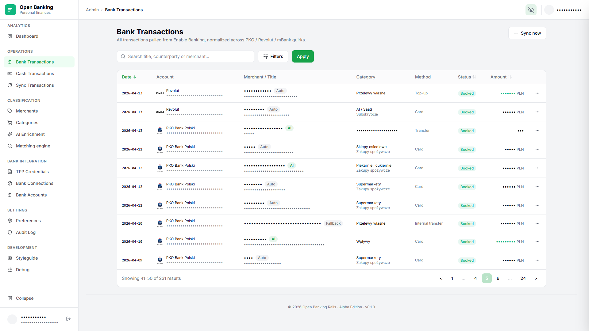

## Why Enable Banking

You can't just plug into a bank's API on your own. PSD2 requires you to
be a licensed AISP, and getting that license is expensive and out of
reach for a personal project. 

[Enable Banking](https://enablebanking.com/docs/api/reference/)
is a licensed provider that sits in the middle: they offer one API for
[most European banks](https://enablebanking.com/open-banking-apis), and
their free tier covers personal use. GoCardless used to offer a similar
free tier but dropped it for personal projects, which is why Enable
Banking is the current choice.

The app talks to the provider through an adapter, so swapping in a different one later is a small change, not a rewrite.

### Read-only by design

AISP is the read-only PSD2 role. It covers account info and transaction history, nothing else. Initiating payments is a separate role (PISP) with a separate license, a separate consent flow, and credentials this app does not hold and never asks for. Even if the API keys leaked, the worst case is someone reading your transactions. Moving money is structurally impossible here.

## Tech stack

| Layer            | Choice                                                        |
| ---------------- | ------------------------------------------------------------- |
| Web              | Rails 8.1, Hotwire (Turbo + Stimulus), Tailwind, Propshaft, Importmap |
| Realtime         | Turbo Streams over Action Cable (Redis-backed) for live sync + LLM enrichment progress |
| Database         | PostgreSQL 17, `ltree` + GiST for hierarchical categories, `scenic` for versioned views, `paper_trail` for audit |
| Background jobs  | Sidekiq + Redis 7, `sidekiq-cron` for per-connection auto-sync |
| Auth             | Devise                                                        |
| Open Banking     | [Enable Banking](https://enablebanking.com/) (PSD2 AISP)      |
| LLM              | [`ruby_llm`](https://github.com/crmne/ruby_llm) (OpenAI `gpt-5-mini` default) |
| Money            | `money-rails` → Money Archetype |
| Search / paging  | Pagy, Ransack                                                 |
| Observability    | OpenTelemetry SDK → Collector → Tempo / Loki / Prometheus / Grafana / Alertmanager |
| Testing          | RSpec, FactoryBot, shoulda-matchers, SimpleCov                |
| Security         | Brakeman, bundler-audit, ActiveRecord encryption              |

## Architecture

### End-to-end flow

A transaction at your bank reaches your dashboard without anyone
touching it.

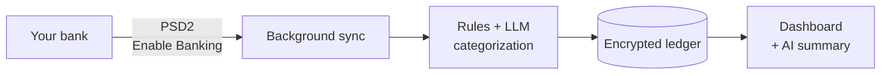

### Trust boundary

What lives on your infrastructure, and the minimum that ever leaves it.

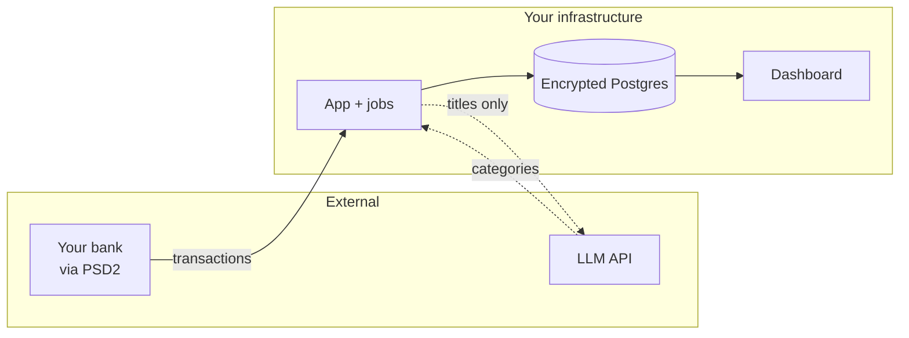

### Hybrid classification

Each new transaction gets a merchant and a category. Rules match the
obvious cases. The LLM picks up the long tail, gated by a confidence
threshold before auto-applying.

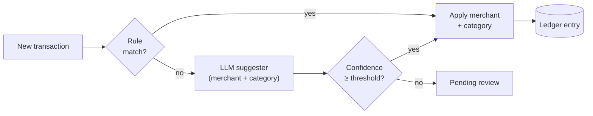

## Self-hosting

Requires Docker 24+ with the Compose plugin. ~2 GB RAM, ~5 GB disk.

```bash
mkdir open-banking-rails && cd open-banking-rails
curl -fsSL https://raw.githubusercontent.com/maciejb2k/open-banking-rails/main/docker-compose.prod.yml -O
docker compose -f docker-compose.prod.yml up -d
```

Open <http://localhost:3000> → first-run page asks for email + password.
That's your only admin account; no second sign-up.

Secrets (`SECRET_KEY_BASE`, AR encryption keys) auto-generate on first
boot and live in a Docker volume. `down`/`up` keeps everything; `down -v`
**wipes your data**. The `app_secrets` volume is also required to
decrypt your backups - back it up alongside `./backups/`.

### Upgrade

```bash
docker compose -f docker-compose.prod.yml pull
docker compose -f docker-compose.prod.yml up -d
```

Pre-migration `pg_dump` runs automatically. Pin a specific image with
`APP_TAG=v1.2.3` in `.env`.

### Backups

Daily `pg_dump` to `./backups/` with 7 daily / 4 weekly / 6 monthly
retention.

### Restore

```bash
docker compose -f docker-compose.prod.yml stop app worker
docker compose -f docker-compose.prod.yml --profile restore run --rm restore
docker compose -f docker-compose.prod.yml up -d app worker
```

Optionally pass a specific dump path after `restore`. Without an arg, it
picks the newest `.sql.gz` under `./backups/`.

### Email (optional)

```
SMTP_ADDRESS=smtp.example.com
SMTP_PORT=587
SMTP_USERNAME=...
SMTP_PASSWORD=...
```

Password reset without SMTP:

```bash
docker compose -f docker-compose.prod.yml exec app \
    bin/rails runner "User.first.send_reset_password_instructions"
```

## Configuring App

Once the container is up and you've created the admin account, this is the post-install walkthrough that takes you from a blank app to a working dashboard.

> **Heads up: you'll go through a bank consent flow twice.** Once on Enable Banking to whitelist the account, then again in this app to actually read it. The two screens look identical and people lose hours conflating them. The first consent is a throwaway whitelist step; only the second one grants transaction access.

1. Register on [Enable Banking](https://enablebanking.com/) and enable MFA.
2. Create a new **API Application** in Enable Banking. Treat it like an OAuth app. It's the gateway this app uses to talk to your bank.
3. **Whitelist your accounts (consent #1, 1 day).** In the Enable Banking UI in the created Application, link each account through their bank flow. The page looks exactly like a real consent screen, but on the free tier this step only registers the account on Enable Banking's whitelist. It does not grant read access. The 1-day expiry is irrelevant; once an account is whitelisted it stays usable. (The free plan has no API for adding accounts, which is why this manual round-trip exists.)
4. In this app, open **TPP Credentials**, mirror the values from the Enable Banking Application, and test the connection.
5. **Authorize transaction reads (consent #2, 90–180 days).** Go to **Bank Connections → Add bank** and run the bank flow again. This one goes through the Enable Banking API and grants *read-only* access to transactions for 90–180 days, depending on the bank. This is the consent that matters and the one you'll renew when it expires. No payments, read-only by design. Use **Refresh from API** on the connection's show page to confirm everything is wired.
6. Bank Accounts appear automatically once the connection syncs.
7. Open **Sync Transactions** and pull history. Most banks cap this at the last 90 days from the day you connect.
8. In **Preferences**, paste an LLM API key (~$5 of OpenAI credit goes a long way) and test the connection.
9. Open **AI Enrichments** and walk through the queue until categories match how you think.
10. Open the dashboard and you're done.

## Styleguide & Component Library

No `ActiveAdmin`, no `Avo`. The admin panel is hand-rolled on Tailwind
and shipped fast with Claude Code, following project rules
(`AGENTS.md`) that pin the LLM to design tokens, sensitive-data
wrapping and reusable partials. The output is a small component library
and a fully responsive admin built on top of it.

Browse `/admin/styleguide` for every component and its variants.

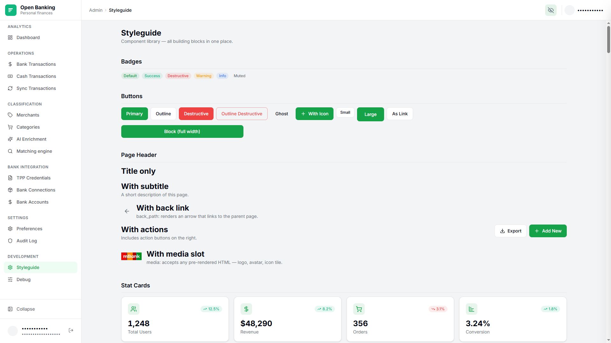

## Screenshots

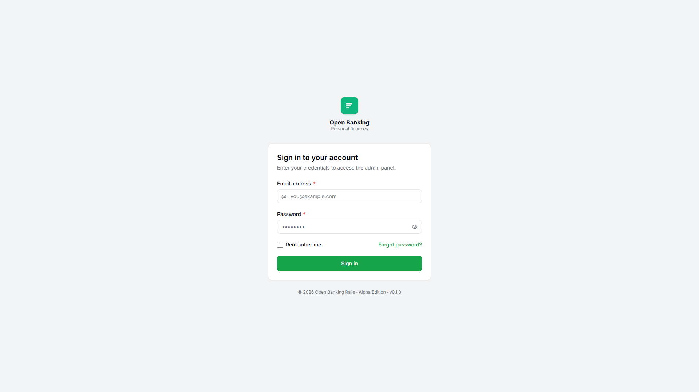

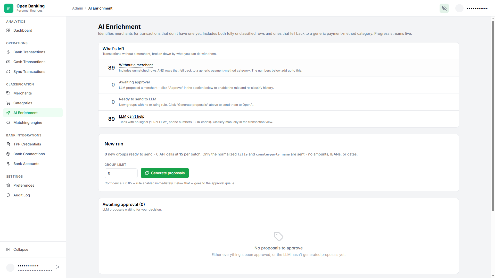

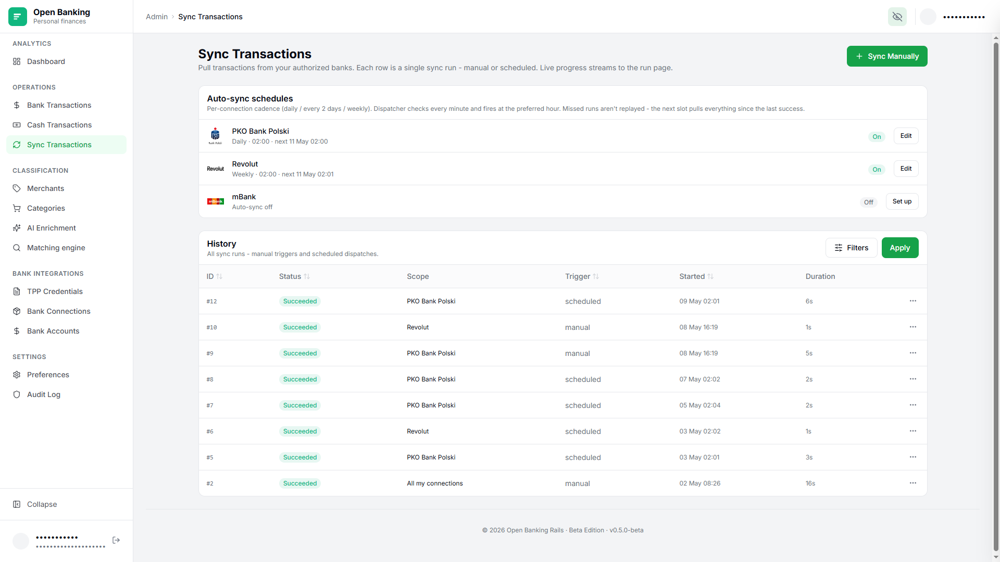

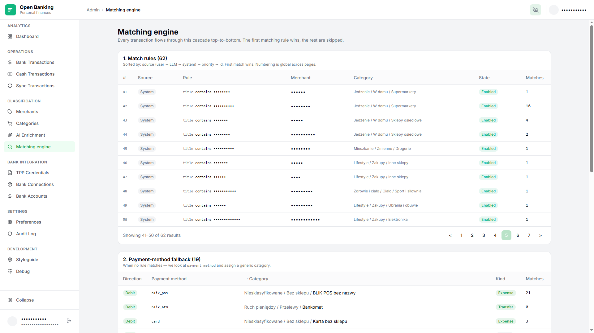

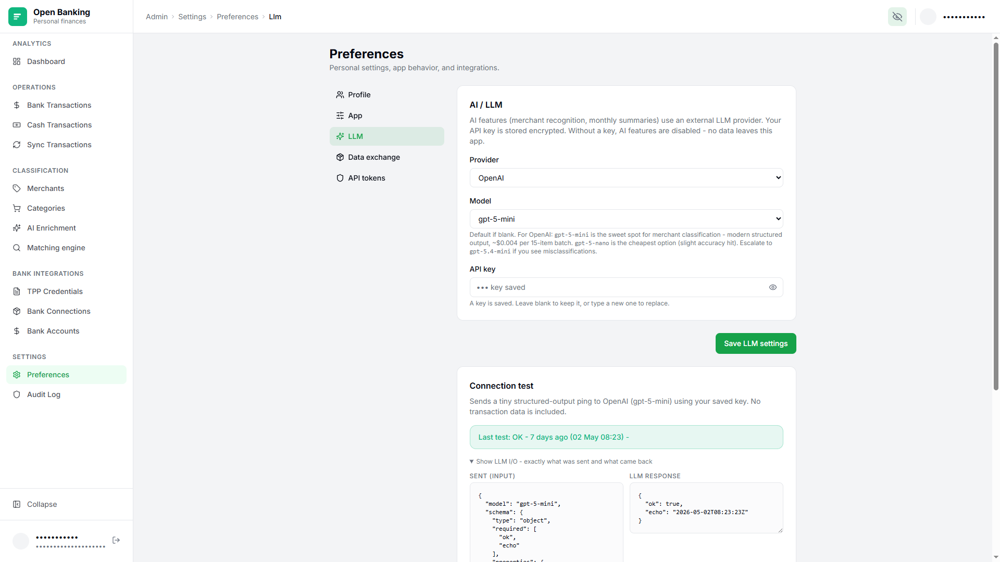

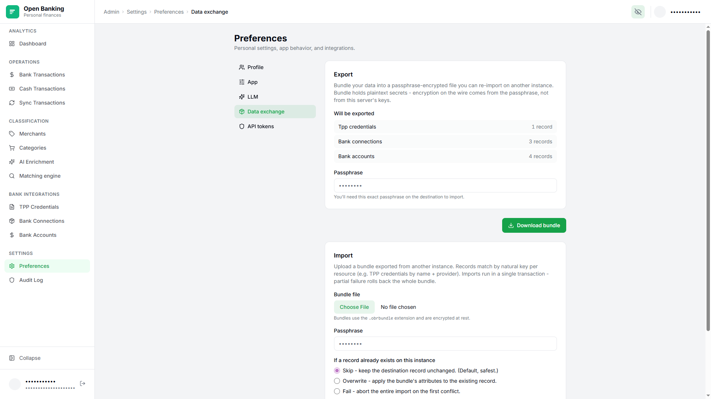

## License

MIT. See [`LICENSE`](LICENSE).
